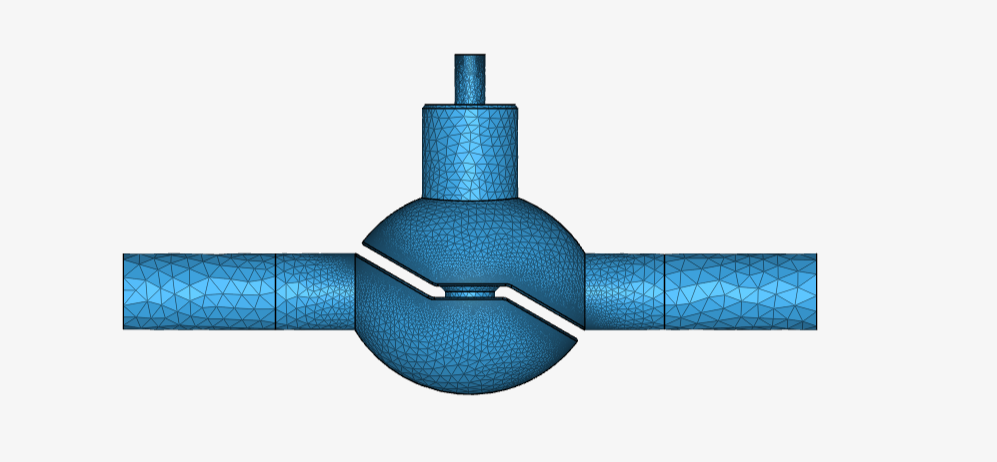
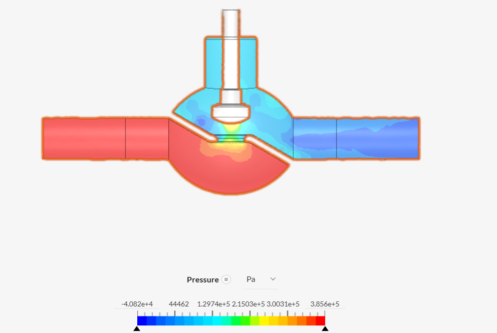
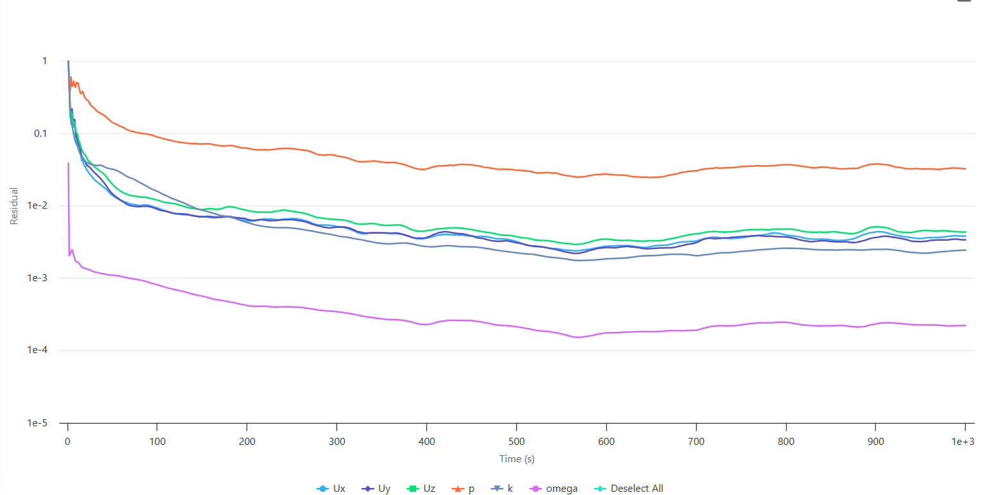
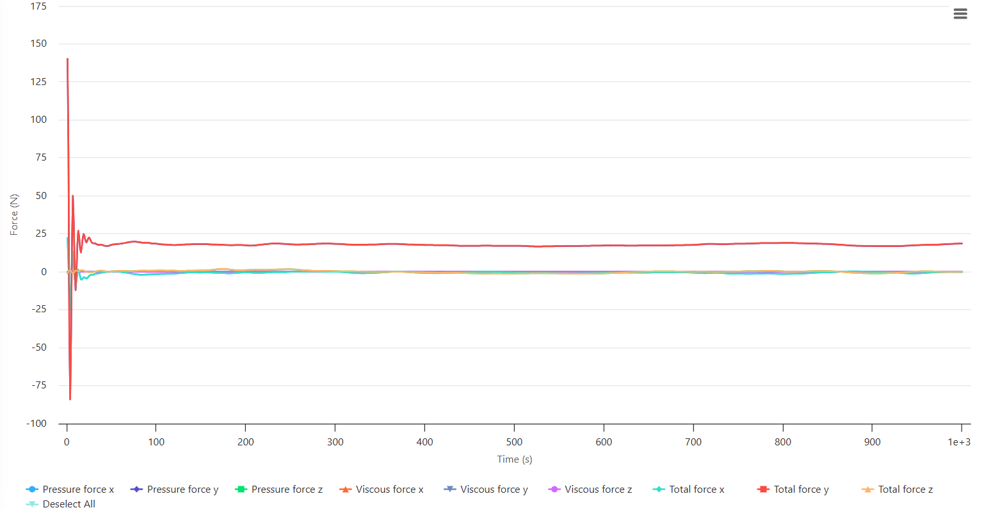
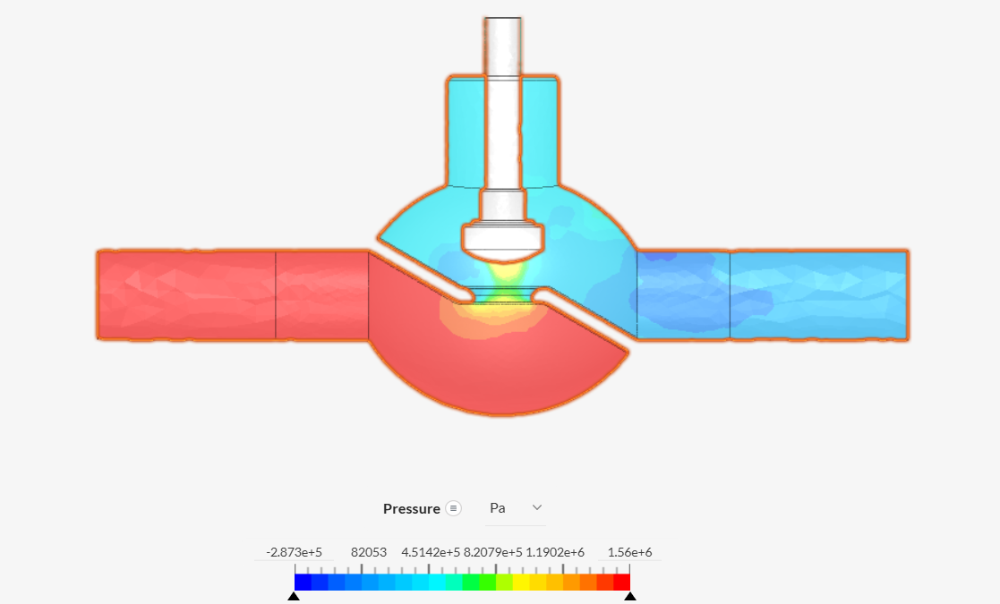
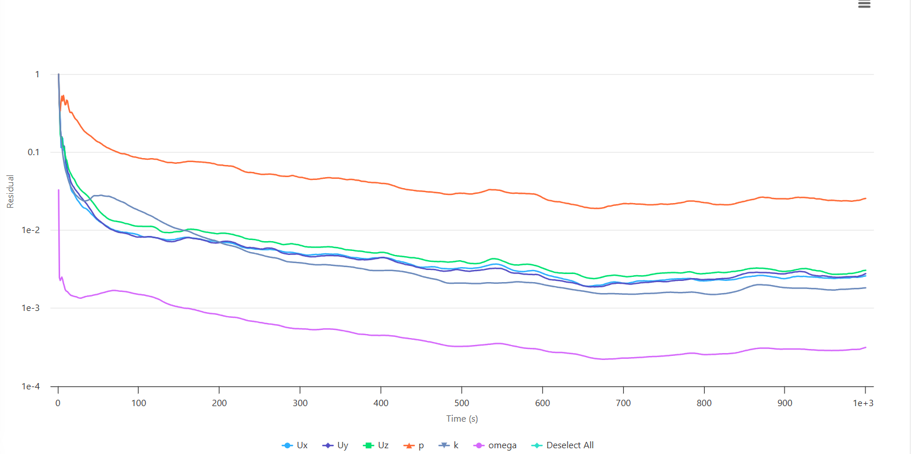
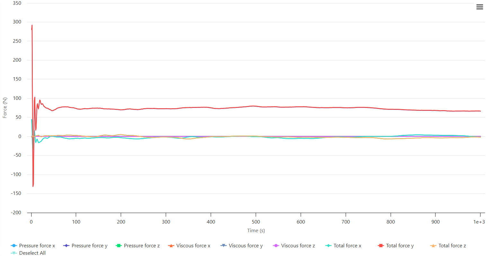

# CFD Analysis of Flow Through a Globe Valve Using SimScale

## 1. Project Overview

This project presents a Computational Fluid Dynamics (CFD) investigation of incompressible water flow through a globe valve using SimScale.

The study focuses on the pressure distribution within the valve and the hydraulic forces acting on the valve stem at different inlet velocities.

A globe-valve geometry obtained from an existing CFD project was used as the starting geometry. An internal flow volume was subsequently created to define the computational fluid domain.

A steady-state incompressible flow analysis was performed using the k–ω SST turbulence model. Two operating cases were simulated with inlet velocities of **2 m/s** and **4 m/s**.

In addition to pressure-field visualization, an area-average quantity was created at the inlet and a force-and-moment calculation was defined to evaluate the forces acting on the valve stem.

The project demonstrates the application of CFD to valve-flow analysis and provides insight into the relationship between flow velocity, pressure distribution, and hydraulic loading on valve components.

---

## 2. Project Objectives

The main objectives of this study were to:

- Investigate incompressible water flow through a globe valve.
- Analyze pressure distribution within the valve flow passage.
- Examine the effect of inlet velocity on the pressure field.
- Evaluate hydraulic forces acting on the valve stem.
- Compare valve behavior at 2 m/s and 4 m/s inlet velocities.
- Monitor solver residuals during the simulations.
- Develop practical experience in CFD analysis of process equipment.
- Demonstrate the use of force and moment calculations in CFD post-processing.

---

## 3. Simulation Setup

| Parameter | Specification |
|---|---|
| **CFD Platform** | SimScale |
| **Analysis Type** | Incompressible Flow |
| **Analysis Approach** | Steady-state |
| **Turbulence Model** | k–ω SST |
| **Working Fluid** | Water |
| **Computational Domain** | Internal flow volume |
| **Mesh Fineness** | 3 |
| **Number of Operating Cases** | 2 |
| **Case 1 Inlet Velocity** | 2 m/s |
| **Case 2 Inlet Velocity** | 4 m/s |
| **Inlet Monitoring** | Area-average quantity |
| **Force Monitoring** | Forces and moments |
| **Primary Force of Interest** | Valve-stem force |

The same mesh and general physical model were used for the two operating conditions so that the effect of inlet velocity could be investigated.

---

## 4. Geometry Preparation

The globe-valve geometry was obtained from an existing project and used as the starting point for the CFD model.

The geometry contains:

- Upstream pipe section.
- Globe-valve body.
- Internal valve passage.
- Valve plug/stem assembly.
- Downstream pipe section.

An internal flow volume was created to represent the fluid region through which water flows.

### Geometry Preparation Workflow

1. Import the globe-valve geometry into SimScale.
2. Prepare the geometry for internal-flow analysis.
3. Create the internal flow volume.
4. Define the fluid region.
5. Identify inlet and outlet boundaries.
6. Identify the valve surfaces relevant to force calculation.
7. Generate the computational mesh.
8. Define the CFD analysis and boundary conditions.

---

## 5. Geometry and Mesh

The computational mesh was generated using a SimScale fineness setting of **3**.

The mesh resolves the main flow passage and the geometric features of the globe valve, including the region around the valve plug and stem.

Mesh resolution is particularly important in valve simulations because strong pressure and velocity gradients can occur near restrictions and changes in flow direction.

A formal mesh-independence study was not performed for this project. Therefore, the results should be interpreted with the limitations associated with the selected mesh resolution.

---

## 6. Material

| Region | Material |
|---|---|
| **Internal flow region** | Water |

Water was selected as the working fluid and treated as an incompressible fluid.

---

## 7. Boundary Conditions

The primary operating parameter varied between the two simulation cases was the inlet velocity.

| Boundary / Parameter | Case 1 | Case 2 |
|---|---:|---:|
| **Inlet velocity** | 2 m/s | 4 m/s |
| **Outlet condition** | Pressure outlet | Pressure outlet |
| **Working fluid** | Water | Water |
| **Analysis** | Steady-state | Steady-state |

The inlet velocity was specified directly at the valve inlet.

The outlet was defined using a pressure-outlet boundary condition.

---

## 8. Inlet Area-Average Monitoring

An area-average quantity was created at the inlet to monitor the flow conditions over the inlet cross-section.

This provides a useful way of evaluating the inlet flow field and checking the consistency of the applied boundary condition.

Monitoring area-averaged quantities is useful when comparing different operating conditions because it provides a representative value over the complete inlet surface rather than relying on a single point.

---

# 9. Force and Moment Analysis

A forces-and-moments calculation was created to evaluate the hydraulic loading on the valve stem.

The force calculation includes contributions from:

- Pressure forces.
- Viscous forces.
- Total force components.

The primary engineering quantity of interest in this project is the **force acting on the valve stem**.

This information is relevant to valve design because fluid-induced forces can contribute to actuator loading and mechanical stresses in valve components.

---

# 10. Results — 2 m/s Inlet Velocity

## 10.1 Pressure Distribution

The pressure contour for the 2 m/s case shows a strong pressure variation through the globe-valve geometry.

The pressure field changes significantly around the valve restriction and near the valve plug. The downstream region exhibits a lower-pressure field relative to the upstream region.

The displayed pressure range is approximately:

**−40.8 kPa to 385.6 kPa**

The local pressure distribution demonstrates the strong influence of the valve geometry on the flow field.

---

## 10.2 Solver Residuals

The residuals initially decrease rapidly as the solution develops.

During the later portion of the simulation, several residuals stabilize within approximately the \(10^{-3}\) to \(10^{-2}\) range, while the omega residual reaches a lower level.

The residual history indicates substantial numerical reduction, although not every residual reaches an extremely low value.

Therefore, residual reduction should be considered together with monitored engineering quantities when assessing convergence.

---

## 10.3 Valve-Stem Force

The force history initially shows strong transients as the simulation develops.

After the initial transient period, the dominant total force component stabilizes at approximately:

**18–20 N**

The remaining force components are comparatively small.

This indicates that the valve experiences a relatively stable hydraulic loading after the initial numerical transient.

---

# 11. Results — 4 m/s Inlet Velocity

## 11.1 Pressure Distribution

The 4 m/s case produces a substantially stronger pressure field compared with the 2 m/s case.

The displayed pressure range is approximately:

**−287 kPa to 1.56 MPa**

The larger pressure variations are concentrated around the valve restriction and internal valve components.

The results demonstrate that increasing the inlet velocity significantly changes the pressure field within the valve.

---

## 11.2 Solver Residuals

The residuals decrease substantially from their initial values and gradually approach a relatively stable range.

Several residuals remain in the \(10^{-3}\) to \(10^{-2}\) range toward the end of the simulation, while the omega residual reaches a lower magnitude.

The residual behavior indicates numerical stabilization, although additional monitored quantities would provide a stronger basis for a formal convergence assessment.

---

## 11.3 Valve-Stem Force

The force history shows a strong initial transient followed by stabilization.

The dominant total force component settles at approximately:

**65–75 N**

This represents a substantial increase compared with the approximately 18–20 N obtained for the 2 m/s case.

---

# 12. Effect of Inlet Velocity on Valve Force

The two simulations demonstrate a clear increase in hydraulic force with increasing inlet velocity.

| Inlet Velocity | Approximate Dominant Stem Force |
|---:|---:|
| **2 m/s** | 18–20 N |
| **4 m/s** | 65–75 N |

The force increases significantly when the inlet velocity is doubled from 2 m/s to 4 m/s.

This behavior is physically reasonable because fluid dynamic loading is strongly dependent on velocity. Dynamic pressure scales approximately with the square of velocity:

$$
q = \frac{1}{2}\rho U^2
$$

Therefore, increasing velocity can produce a disproportionately large increase in pressure-related hydraulic loading.

The CFD results are qualitatively consistent with this behavior, although two operating points alone are not sufficient to establish an exact quadratic relationship between velocity and stem force.

---

# 13. Pressure-Field Comparison

The pressure contours show a substantial difference between the two operating conditions.

At **2 m/s**, the displayed pressure range is approximately:

**−40.8 kPa to 385.6 kPa**

At **4 m/s**, the displayed pressure range is approximately:

**−287 kPa to 1.56 MPa**

The higher-velocity case therefore exhibits substantially larger pressure variations.

The strongest pressure gradients occur near the valve restriction and internal valve components, where the flow passage changes significantly.

These regions are important because they are associated with local flow acceleration, deceleration, pressure recovery, and hydraulic loading on the valve components.

---

# 14. Engineering Interpretation

The CFD results demonstrate the effect of operating velocity on globe-valve flow behavior.

Increasing the inlet velocity from 2 m/s to 4 m/s results in:

- Stronger pressure variations.
- Greater hydraulic loading on the valve stem.
- Higher local pressure gradients.
- Increased sensitivity of the flow field around the valve restriction.

The force results are particularly relevant to valve engineering because the hydraulic force acting on the stem contributes to the mechanical load that must be overcome by the valve actuator.

For practical valve design, this information can be used as part of an assessment of actuator sizing and mechanical loading.

However, actuator sizing would require additional design information and should not be based solely on the CFD force results presented here.

---

# 15. Force-Result Interpretation

The force histories show a pronounced initial transient in both operating cases.

After the initial transient:

- The 2 m/s case stabilizes at approximately 18–20 N.
- The 4 m/s case stabilizes at approximately 65–75 N.

The relatively stable force histories during the later part of the simulations indicate that the hydraulic loading becomes much more consistent after the initial numerical development.

The dominant force component is significantly larger than the other force components, indicating that the principal hydraulic loading on the selected valve-stem direction is strongly directional.

---

# 16. Convergence Assessment

Both simulations show a substantial reduction in solver residuals from their initial values.

The force histories also show an initial transient followed by a relatively stable region.

This provides two complementary indicators of numerical stabilization:

1. Reduction and stabilization of solver residuals.
2. Stabilization of the monitored hydraulic force.

A stronger convergence assessment would additionally consider:

- Mass conservation.
- Pressure stability.
- Outlet flow rate.
- Area-averaged inlet quantities.
- Stability of the force and moment values over the final portion of the simulation.

Therefore, the present results demonstrate **substantial numerical stabilization**, but the residual and force histories should be interpreted together rather than using residuals alone as a convergence criterion.

---

# 17. Limitations

The following limitations should be considered when interpreting the results:

- The original valve geometry was obtained from an existing project.
- Only one mesh resolution was investigated.
- A formal mesh-independence study was not performed.
- Only two inlet velocities were simulated.
- The quantitative pressure drop between specified inlet and outlet locations was not independently extracted.
- The force results represent the selected CFD force calculation and should be interpreted according to the surfaces included in that calculation.
- The CFD force should not be directly treated as the complete actuator sizing requirement without considering mechanical friction, packing forces, differential pressure, safety factors, and valve design specifications.
- Further validation against experimental or manufacturer data would strengthen the quantitative conclusions.

---

# 18. Future Work

Future investigations could include:

1. **Mesh-independence study**

   Compare coarse, intermediate, and fine meshes to determine the sensitivity of pressure and stem force to mesh resolution.

2. **Additional velocity cases**

   Simulate additional inlet velocities to establish the relationship between flow velocity and valve-stem force.

3. **Pressure-drop calculation**

   Extract pressure at consistent inlet and outlet locations and calculate:

$$
\Delta P = P_{in} - P_{out}
$$

4. **Force versus velocity analysis**

   Plot the stabilized stem force against inlet velocity.

5. **Actuator-load assessment**

   Use the CFD-derived hydraulic force as an input for a more complete valve actuator-loading analysis.

6. **Flow visualization**

   Investigate velocity contours, streamlines, and recirculation zones around the valve plug.

7. **Mesh refinement**

   Increase mesh resolution near the valve restriction and other regions with strong pressure and velocity gradients.

---

# 19. Key Findings

The main findings from the two CFD operating cases are:

- The globe-valve geometry produces substantial pressure variation due to the internal flow restriction.
- Increasing inlet velocity from **2 m/s to 4 m/s** significantly increases the pressure variation within the valve.
- The dominant hydraulic force on the valve stem increases from approximately **18–20 N** to **65–75 N**.
- Both simulations show an initial transient followed by relatively stable force behavior.
- Solver residuals decrease substantially during both simulations.
- The results demonstrate the strong influence of flow velocity on hydraulic loading of valve components.

The study therefore illustrates how CFD can be used not only to visualize flow and pressure fields but also to estimate component-level hydraulic forces relevant to process-equipment design.

---

# 20. Skills Demonstrated

- Computational Fluid Dynamics (CFD)
- SimScale
- Internal flow analysis
- Globe-valve flow analysis
- k–ω SST turbulence modeling
- Steady-state CFD
- Internal flow-volume extraction
- Boundary-condition specification
- Computational meshing
- Pressure-field visualization
- Force and moment analysis
- Valve-stem hydraulic loading
- Solver residual analysis
- Convergence assessment
- Parametric operating-condition comparison
- Process equipment CFD analysis

---

# 21. Simulation Project

**SimScale Project:**  
[View the globe-valve CFD simulation](https://www.simscale.com/projects/mehwish_akhtar/cfd_simulation_of_pipe_flow_and_valve_pressure_1579652103/)

---

# 22. Geometry Acknowledgment

The starting globe-valve geometry was obtained from an existing CFD project.

The original geometry is acknowledged to distinguish the source geometry from the CFD setup, operating-condition comparison, force analysis, post-processing, and engineering interpretation presented in this repository.
